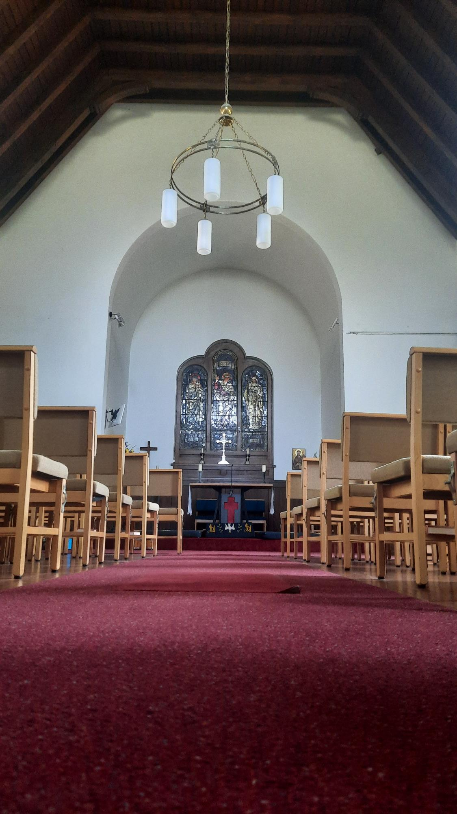

+++
title = "Englisch – oder vielleicht auch nicht"
date = "2023-05-17"
draft = false
pinned = true
tags = ["Anglikanismus", "Kirche", "St.Ursula", "Reportage"]
image = "stu_spring2.jpg"
description = "Die St. Ursula Kirche ist eine kleine anglikanische Kirche direkt neben dem Gymnasium Kirchenfeld.  Doch was ist eigentlich Anglikanismus und wie tickt das Leben in dieser Kirche?"
footnotes = ""
+++

Die Integration einer englischen Kirche in Bern und ihr christlicher Weg


- - -





## Eine ganz gewöhnliche Kirche – und doch anders

Es ist Pfingstsonntag. In zehn Minuten beginnt der Gottesdienst. Der Pfarrer und seine Frau begrüssen die ankommenden Menschen verschiedenster Kulturen. Eine Band bestehend aus freiwilligen Musikern übt ihre Stücke ein, während die Leute sich einen Platz auf den Bänken suchen. Sie begrüssen sich herzlich wie alte Bekannte und tauschen sich untereinander über Kleinigkeiten aus.

Die Halle der Kirche ist gross. Sie hat eine hohe Decke mit Kronenleuchtern, ist breit und geräumig gebaut und ist doch gemütlich. Der rote Teppich fühlt sich gut unter den Füssen an. Die Morgensonne scheint durch die grossen, hohen Fenster und wirft sanftes Licht in den Raum. Von allen Sitzplätzen aus kann man den Altar gut sehen. Darüber befindet sich ein Kirchenfenster mit Abbildungen von der Heiligen Ursula, der Heiligen Etheldreda und des Jesus Christus.

Dann klingt die Kirchenglocke. Die Pfarrerin tritt vor den Altar und begrüsst die ungefähr neunzig anwesenden Mitglieder der Kirche. Sie gibt einige Informationen über den Ablauf des Gottesdienstes und über Ereignisse der kommenden Tage kund. Sie lädt dazu ein, an den kommenden Spendenaktionen teilzunehmen und der Kirche einen Dienst zu erweisen, indem jeder und jede sein können für Hilfe anbietet. Nun kann der Gottesdienst beginnen. Es wird gebetet und gesungen. Anschliessend zum letzten Lied gibt der Pfarrer eine Rede über den Heiligen Geist, den Herrn und seinen Sohn. Als Finale zum Gottesdienst wird die Mitgliedschaft eingeladen, zum Altar zu gehen, um Brot, Wein und einen Segen der Pfarrer zu erhalten.

## Gratis spenden

Es ist das erste Mal in der Kirche der St. Ursula, dass die Delegierten eine Auktion veranstalten. Nach dem Gottesdienst werden die Anwesenden zum Kaffee eingeladen, während die verschiedenen Angebote präsentiert werden. Es gibt alles Mögliche, von verschiedensten Leuten zur Verfügung gestellt. Es gibt selbstgemalte Bilder, Kuchen, Französischlektionen und sogar ein Dinner mit dekoriertem Kuchen. Während einem gemeinsamen Mittagessen zum Anlass der Pfingsttage sind alle Anwesenden eingeladen, die vorgestellten Produkte und Dienste anzuwerben. Das Geld, dass bei der Auktion geboten wird, würde an die Kirche gehen. Man bezahlt also für die Angebote, aber man selbst stellt seine Produkte und Dienste gratis zur Verfügung. 

Nach dem Mittagessen gibt es eine Ankündigung, dass die Auktion nun beginnen würde. Nachdem sich die meisten Diskussionen gelegt haben, beginnt die Verteilung der Angebote. Die Preise und Produkte sind vielseitig, von teurem Dinner und Gemälden zu Muffins. Für all diese Gegenstände fangen die Gebote klein an und steigen, bis eine letzte Person das Angebot gewinnt, unter grossem Applaus. Auch die Priester bieten Preise, in der Hoffnung, das finale Gebot zu steigern.

## Politische oder religiöse Hintergründe

Die Anglikanische Kirche entstand 1534 durch die Trennung des Königs von England, Henry VIII, von der römisch-katholischen Kirche, die vom Papst regiert wurde. Henry VIII wollte, dass die Englische Kirche vom König regiert würde, nicht von Vatikanstadt. Dies hatte den Grund, dass Henry VIII sich von seiner Frau scheiden lassen wollte, was der Papst nicht gewährte.

Während dieser Zeit war die Römische Kirche streng katholisch ausgerichtet, was sich nach der Machtverschiebung zum König von England änderte. Als der Papst die Macht über die Englische Kirche verlor, verbreitete sich der Protestantismus.

Solche religiösen Änderungen kamen noch einige Male vor; Als Henrys Thronfolger, Edward VI, jung starb, trat seine Schwester Mary seine Nachfolge an. Sie stellte die Autorität der Römisch-Katholischen Kirche wieder her. Doch sie regierte nur fünf Jahre, und ihre Nachfolgerin Elizabeth stellte ihrerseits die Reformation wieder her, aber auf eine charakteristische Weise. Elizabeth wollte einen Mittelweg zwischen einer moderaten, nicht so strengen Art des Protestantismus und einigen Aspekten der katholischen Religion.

Heute hat die Anglikanische Kirche immer noch einen Glauben zwischen dem Protestantischen und dem Katholischen. Ein Anglikaner oder eine Anglikanerin kann sich auch zwischen drei anderen Wegen entscheiden: der Anglo-Katholischen, der Protestantischen und der Liberalen Kirche. Die Anglo-Katholische Kirche folgt den Traditionen der Katholischen Kirche. Die Protestantische Kirche befasst sich mehr mit dem theologischen Verständnis der Heiligen Schrift. Sie folgt den Ideologien von Johannes Calvin und Martin Luther. Die liberale Kirche hingegen legt weniger Wert auf die Interpretation der Bibel oder den Traditionen des Katholizismus'. Stattdessen beschäftigt sie sich mit dem Menschen und der Gesellschaft. Sie zeigt Menschen ausserhalb der Kirche eine christliche Lebensweise, indem sie sich mit aktuellen Problemen unserer Welt befasst und sich neues wissenschaftliches Wissen aneignet.

Diese drei Arten des Anglikanismus' stützen sich gegenseitig wie Stuhlbeine einen dreibeinigen Hocker. Die Anglikanische Kirche ist ein Gleichgewicht zwischen diesen drei Säulen und kippt, sobald eine Stütze weggenommen wird.



Die Kirche der St. Ursula wurde 1906 erbaut, unter der Sponsorschaft einer amerikanischen Frau aus St. Louis, Missouri. Als Dank für die Erholung ihrer Tochter hat sie der Stadt Bern als Dank Geld gespendet. 1959 wurden der Kirche weitere Gebäude angefügt und 1992 wurde sie wieder vergrössert, dank einer Spende des Kantons.

Ihren Namen hat die Kirche der heiligen Ursula zu verdanken. Sie war eine Britische Prinzessin, die in Begleitung von 11'000 Jungfrauen nach Rom gepilgert ist. Bei ihrer Rückkehr wurden sie in Köln ermordet.



## Unter fremden Freunden

Die Kirche der St. Ursula ist eine dynamische Gemeinschaft, mit ständigen Änderungen in den Mitgliedern, den Spendenaktionen und den Veranstaltungen. Menschen kommen und gehen mit ihrem Migrationshintergrund und suchen sich eine temporäre Lösung für ihren Glauben, an dem sie effektiv teilnehmen können. Sprache ist nämlich ein wichtiger Aspekt der Anglikanischen Kirche; Englisch ist eine universelle Sprache, nicht wie Deutsch oder Schweizerdeutsch. Menschen aus aller Welt, sei es aus Neuseeland, Griechenland, Togo oder den Vereinigten Staaten, sind stets willkommen, den Gottesdiensten in einer Sprache, die sie verstehen, zu leisten.

Die Gemeinschaft dieser Kirche ist sehr dynamisch; Leute kommen und gehen, und das aus unterschiedlichsten Ländern. Ein langjähriges Mitglied gehörte der presbyterianischen Kirche an, bevor er seine Frau traf, die Anglikanerin war. Nun sind sie beide Anglikaner. Sie sind gemeinsam nach Kanada gezogen, wo sie einige Male die Anglikanische Kirche besucht haben, und sind nun in der Schweiz. Den Grund dafür, dass er eine englischsprachige Kirche besucht, erklärt er wie folgt:

>  «I can only understand my faith in the language that I understand. (Ich kann meinen Glauben nur in einer Sprache verstehen, die ich auch verstehe)»

Die Kirche hat auch viele Mitglieder aus ganz anderen Ländern, mit ganz anderen Hintergründen. Eine hergezogene Neuseeländerin wollte die Schweizer Reformkirche besuchen. Allerdings haben sich sprachliche Grenzen gelegt: sie verstand die Gottesdienste nicht und fühlte sich deswegen nicht willkommen. Darum wechselte sie wieder in die Anglikanische Religion und besuchte die Kirche der St. Ursula.

Die Kirche nimmt auch Flüchtlinge auf. Zwei Nigerianer kamen in die Kirche, aber nicht unter erwarteten Umständen: Zu Beginn des Ukraine-Krieges kamen sie von dort in die Schweiz, doch aufgrund ihrer Herkunft mussten sie bald wieder zurückkehren.

Doch nicht nur Mitglieder kommen und gehen, sondern auch Priester. Sie verändern die Stimme der Gottesdienste, geben ihnen eine neue Atmosphäre.

Die Kirche hilft aber auch in anderen Gebieten; sie unterstützt nämlich viele verschiedene Wohltätigkeitsorganisationen, und das in verschiedenen Gebieten. So spendet sie beispielweise an eine Organisation gegen HIV/AIDS, in verschiedenen Gebieten in Afrika und anderen Entwicklungsländern, beispielsweise bei der Wasserversorgung, Nahrungsmitteln und der Bildung.

Die Kirche hilft nicht nur ausserhalb der Schweiz, sondern auch im Inland. In den vergangenen Jahren hat sie die Sammlung von Essen für Flüchtlinge des Ukraine-Krieges unterstützt. Zuständige sagten allerdings, dass sie manchmal aufgrund der Sprachgrenze Probleme in der Kommunikation hatten und deshalb nicht so effektiv mithelfen konnten, wie sie es eigentlich gewollt hätte.

Heute noch gibt es zahlreiche Organisationen weltweit, die sie schon über einen längeren Zeitraum unterstützen. Der interne Organisationsrat der Kirche wählt, welchen Organisationen geholfen werden soll. Der Rat informiert sich über verschiedene Organisationen und entscheidet gemäss der finanziellen Mittel der Kirche, welchen Stiftungen sie aushelfen, und vor allem wie viel. Viele der Kirchenmitglieder helfen auch ausserhalb des Rahmens der Kirche, indem sie Spenden.

Die dynamische Gemeinschaft und die Entfernung zu anderen Anglikanischen Kirchen – mit der nächsten in Basel – führt zu einer vielfältigen Interpretation der christlichen Religion, um möglichst viele Bedürfnisse für möglichst viele Mitglieder zu erfüllen. Ein Priester der Kirche, David Marshall, sagte dazu, dass die Kirche vielleicht nicht für jeden und jede perfekt ist, aber er hofft, dass sie wenigstens gut genug ist.

Die Gesellschaft der Kirche ist nicht nur dynamisch, sondern auch sehr engagiert und äusserst hilfsbereit. All das, worum man sich innerhalb der Gesellschaft und der Kirche kümmern muss, wie zum Beispiel die Aufbewahrung des Gebäudes, den Garten, die Musik und auch den finanziellen Zustand der Kirche, wird mithilfe jedes Mitgliedes der Gemeinschaft erledigt. Jeder und jeder hilft, wo er oder sie kann, um der Kirche zu helfen; wenn man ein guter Gärtner ist, hilft man, indem man sich um den Garten kümmert. Wenn man sich in Handarbeit und Reparaturen versteht, hilft man der Kirche, indem man für den Unterhalt des Gebäudes sorgt. Sogar die Musik, die an Gottesdiensten gespielt wird, wird von talentierten Mitgliedern der Kirche gespielt. Diese Hilfsbereitschaft der Gemeinschaft macht die Atmosphäre angenehmer und stärkt den Zusammenhalt und die Freundschaft zwischen den Leuten. Es fühlt sich an, als wäre man unter guten Kollegen oder Freunden, denen man Vertrauen schenken kann.

{{<box>==collapsible}}

